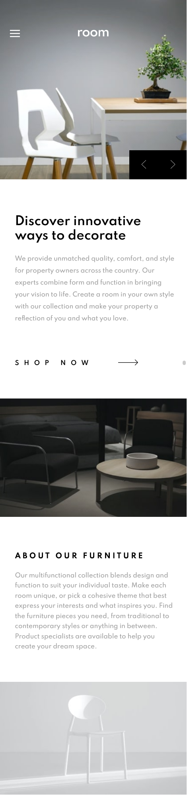

# Frontend Mentor - Room homepage solution

This is a solution to the [Room homepage challenge on Frontend Mentor](https://www.frontendmentor.io/challenges/room-homepage-BtdBY_ENq). Frontend Mentor challenges help you improve your coding skills by building realistic projects. 

## Table of contents

- [Overview](#overview)
  - [The challenge](#the-challenge)
  - [Screenshot](#screenshot)
  - [Links](#links)
- [My process](#my-process)
  - [Built with](#built-with)
  - [What I learned](#what-i-learned)
  - [Continued development](#continued-development)
  - [Useful resources](#useful-resources)

## Overview

### The challenge

Users should be able to:

- View the optimal layout for the site depending on their device's screen size
- See hover states for all interactive elements on the page
- Navigate the slider using either their mouse/trackpad or keyboard

### Screenshot

### Links

- Solution URL: [Github pages](https://thomas-auffroy.github.io/Room-Homepage/)

## My process

### Built with

- Semantic HTML5 markup
- CSS custom properties
- Flexbox
- Js

### What I learned

This challenge is the first one where I need to create a slider of images. I would like to add animation on this slider, but the way I built my HTML makes this impossible. I guess when I use images on project, I must use the tag  rather than use it as a background-image. This way, play with animation makes the task easier. 

When I need to deal with animation, or link my Js to my HTML, I must not use pseudo-elements :before and :after. Indeed, these are painfull if I want to attach some js function to them.

I tried to play with in build tag like <nav> or <header> to have a better structure. 

Maybe use onclick() on buttons rather than put EventListener, this can reduce the length of my js.

### Continued development

My js skills and deal with images.

### Useful resources

- [Mozilla](https://developer.mozilla.org/fr/) - The main site where I look for informations
